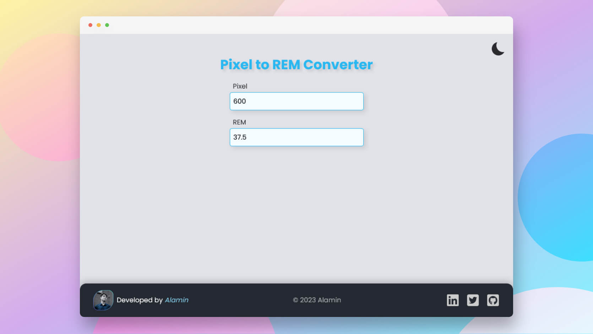

# Pixel to REM Converter

<h2 align="center">

[🚀Live Website](https://px-to-rem-converter-codepapa360.netlify.app)

</h2>

<!-- Badges -->

<!-- Liceensee -->

<!-- Screenshot -->

<!-- Brief -->

Pixel to Rem Converter is a handy web application that assists web developers and designers in converting pixel measurements to rem units and vice versa. This tool helps ensure consistent and responsive design across different devices and screen sizes.

<!--  -->

## Features

- Convert pixel values to rem units.
- Convert rem values to pixel units.
- User-friendly interface with input fields for both pixel and rem conversions.
- Instant conversion feedback.
- Dark mode toggle

## Built with

- Vanilla JavaScript
- SASS
- HTML5
- Vite - Module bundler

## Contact

Feel free to contact me with any questions or feedback!

<b>👤 Alamin</b>

- Twitter - [@CodePapa360](https://www.twitter.com/CodePapa360)
- LinkedIn - [@CodePapa360](https://www.linkedin.com/in/codepapa360)
- Frontend Mentor - [@CodePapa360](https://www.frontendmentor.io/profile/CodePapa360)
- Github: [@CodePapa360](https://github.com/codepapa360)

## License

This project is licensed under the [MIT](https://github.com/CodePapa360/Pixel-to-REM-Converter/blob/main/LICENSE.md) License - see the LICENSE file for details.

